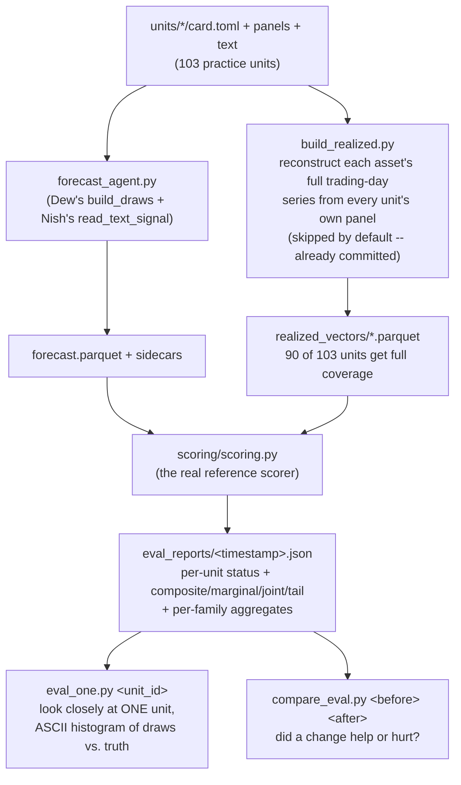

# Track 2 — local eval pipeline (Pun's `feat/eval` branch)

## Executive summary (read this first)

This is the local evaluation harness described in `TEAM_TASKS.md`'s "Pun · Evaluation" section.
It runs `forecast_agent.py` against every practice unit, scores each one for real (CRPS /
joint variogram / tail penalty — the actual competition formula), and tells you whether a
change to `build_draws()` (Dew) or `read_text_signal()` (Nish) made things better or worse.
**One command runs the whole thing:**

```bash
python eval_pipeline.py
```

No FRED, no API key, no network — every number comes from data already in this repo.

---

## Quick start — first time here (for a teammate, or their Claude)

**0. Environment set up?** If not:
```bash
git clone https://github.com/AGENTHON-26/track2-forecasting-public
cd track2-forecasting-public
git checkout feat/eval    # or whichever branch has this pipeline merged in

pip install "qfbench2-common[data] @ git+https://github.com/Agenthon-2026/Agenthon2026-public.git@v2.4.0#subdirectory=common"
pip install .
```
**Note, if you're also reading `TEAM_TASKS.md`'s own setup section:** it currently says to clone
a different repo (`track2-team`) and pins the toolkit at `v2.3.1`. Neither is right anymore —
the team ended up working in *this* repo instead, and `v2.3.1` is a known-broken pin (it rejects
a submission descriptor the verifier actually accepts; `v2.4.0` is the fixed tag, confirmed by
this repo's own main README). Use the commands above, not that section, until someone updates it.

**1. Run the whole pipeline:**
```bash
python eval_pipeline.py
```
Takes under a minute. Prints a per-family score summary and writes a JSON report to
`eval_reports/<timestamp>.json`.

**2. Look at what happened.** The terminal output already shows the headline numbers
(how many units scored vs. crashed vs. have no ground truth, and the mean composite per
family). If you want the full per-unit breakdown, open the JSON file it just wrote.

**3. Curious about one specific card?**
```bash
python eval_one.py t2-F3-conundrum-joint-2005
```
Walks that one unit through every pipeline step with full detail, plus an ASCII picture of
whether the forecast's draws actually surrounded the true value.

**4. Made a change and want to know if it helped?** See "Recipes" below — that's exactly what
`compare_eval.py` is for.

That's the whole on-ramp. Everything past this point is reference material: what each script
does in more detail, what the numbers actually mean, and the caveats worth knowing before you
trust one.

---

## The one command, in more detail

```bash
python eval_pipeline.py                              # everything, default settings
python eval_pipeline.py --label "after Nish's LLM call"
python eval_pipeline.py --remine-realized             # only needed after units/ itself changes
python eval_pipeline.py --concurrency 4               # run 4 units at once instead of 1
```

That's it. `realized_vectors/` is committed to the repo and `units/` rarely changes, so
**mining is skipped by default** — the command just runs `run_eval.py` and prints where the
report landed. (Safety net: if `realized_vectors/` is missing or empty — e.g. a very old
checkout — it mines automatically regardless of the flag, since sweeping with zero ground
truth would be silently useless.)

**`--concurrency N`** runs N units' `forecast_agent.py` + scoring at once instead of one after
another (default: 1, sequential) — passed straight through to `run_eval.py`. Each unit is a
separate subprocess, so this is safe to raise; the only real constraint is how hard several
units' worth of concurrent model calls hit the shared endpoint. Measured: sequential averages
~29 s/unit (a full 103-unit sweep in ~50 minutes); `--concurrency 4` measured close to a 4x
speedup, finishing the same sweep in well under 15 minutes.

One thing this flag is **not**: Stage 1's own per-document summarization (`text_signal.py`,
`summarize_corpus()`) *already* runs up to 8 documents in parallel **within** a single unit —
that's separate and always on, `--concurrency` multiplies on top of it (`--concurrency 4` means
up to 32 simultaneous calls, not 4, if a unit-heavy batch lines up).

**This flag only affects our own local sweeps — it says nothing about the real leaderboard.**
Runtime concurrency across units is entirely the organizers' own scoring infrastructure's call:
each unit is scored as its own `docker run <image> forecast --panels … --asof … --out …`
(`SUBMISSION_CLI.md`), and nothing in a submission expresses or requests how many of those run at
once. `--concurrency` is purely a "make our own testing faster" convenience — the concurrency
question that *does* carry into real scoring is the always-on, in-unit one above (Stage 1's
8-worker pool), and whether firing several of a unit's 25 allotted requests concurrently is fine
there is still genuinely undocumented — see `docs/` for what's confirmed vs. open.

---

## The pipeline, visually



`build_realized.py` and `forecast_agent.py` never talk to each other — the "was it actually
right" side of scoring is built completely independently of the thing being scored, on purpose
(see "What's real vs. mined" below).

---

## The five scripts

| Script | What it does | When to run it |
|---|---|---|
| `eval_pipeline.py` | Runs the two below, in order. The one command. | Every time you want a full sweep. |
| `build_realized.py` | Mines real target values from sibling practice panels into `realized_vectors/`. | Only needs rerunning if `units/` changes — the mined values don't depend on `forecast_agent.py` at all. |
| `run_eval.py` | Runs `forecast_agent.py` on every unit, scores each (gates always, real composite wherever a realized vector exists), writes a JSON report. | Every time `forecast_agent.py` changes and you want to know the effect. |
| `eval_one.py <unit_id>` | Walks ONE unit through all five pipeline steps with full detail, plus an ASCII histogram marking where the true value landed among the draws. | Debugging one specific card, or understanding *why* a score is what it is. |
| `compare_eval.py <before.json> <after.json>` | Diffs two reports: status changes, per-family mean deltas, newly-fixed/newly-broken units, biggest per-unit swings. | Before/after any real change — this is the "did it improve?" tool. |

---

## What's real vs. what's ours

**Real, unmodified competition code:** the scoring formula itself. `run_eval.py` and `eval_one.py`
both call `scoring/scoring.py`, which imports `qfbench2_track_forecasting.scoring` — the exact
package the organizers' own scoring image uses. The composite is genuinely:

```
composite = 0.5 x marginal_CRPS + 0.3 x joint_variogram + 0.2 x tail_penalty
```

(or `0.714 x CRPS + 0.286 x tail` for a single-cell card, where the joint term is structurally 0).

**Ours, not the organizers':** the `realized_vectors/*.parquet` files — the "ground truth" side.
`build_realized.py` reconstructs them by pooling every unit's own panel rows and reading off,
for each unit's target, whatever row sits exactly `horizon` trading-days after its as-of date in
that combined series (no calendar-guessing — it uses the data's own real trading-day sequence).
This is legitimate for local eval tooling specifically because `forecast_agent.py` never reads
this file — it doesn't change what the agent sees or does, only how we grade it afterward,
exactly like the organizers' own sealed `realized.parquet` does for the real leaderboard.

**What this number is NOT:** a leaderboard-equivalent score. The real leaderboard divides your
composite by the (sealed, hidden) text-blind baseline's own composite on the same card, so `1.0`
universally means "no better than baseline." We have no way to compute that division locally, so
every composite here is raw — meaningful for **comparing two of our own runs**, not for reading
against the `1.0` anchor the real leaderboard uses.

**Coverage: 90 of 103 units.** The other 13 are `gates_only` (admissible, but no realized value
to score against) for two reasons: the target lives only in the monthly-spaced macro panel (row-
stepping doesn't apply), or no sibling panel extends far enough forward to cover the target date.

---

## The JSON report, field by field

```json
{
  "generated_at": "2026-09-15T19:14:54...",
  "label": null,
  "gates_only_mode": false,
  "total_units": 103,
  "status_counts": {"scored": 90, "gates_only": 13},
  "family_summary": {"T2-F1": {"n": 18, "mean": 0.34, "min": 0.01, "max": 2.58}, ...},
  "units": {
    "t2-F1-cad-boc-2017": {
      "status": "scored",
      "composite": 0.0287,
      "marginal_crps": 0.019,
      "joint_variogram": 0.061,
      "tail_penalty": 0.004,
      "tail_metric": "pinball",
      "category": "T2-F1"
    }
  }
}
```

- **`label`** — whatever you passed to `--label`. **`null` if you didn't pass one** — that's the
  default, not a bug; it just means "no note was given for this run."
- **`status`** per unit is one of: `scored` (real composite available), `gates_only` (admissible,
  no realized data), `inadmissible` (failed a gate), `agent_crashed` (forecast_agent.py itself
  errored), `scorer_crashed` (the scorer's output wasn't parseable JSON — should not normally
  happen).
- **`marginal_crps` / `joint_variogram` / `tail_penalty`** — the three weighted components. Useful
  for diagnosing *why* a score is bad: a card with a huge `joint_variogram` and small everything
  else has a correlation problem, not a direction or tail problem.
- **`tail_metric`** — always `"pinball"` across every practice card today (the current, correct
  metric — measures how *far* a quantile was missed by, not just whether it was crossed). The only
  other registered option, `"coverage"`, is a deprecated, buggier metric kept only so an old score
  computed under it can still be reproduced; no card currently selects it.

---

## Recipes

**Did my change help?**
```bash
python eval_pipeline.py --label "before my change" --out eval_reports/before.json
# ... make the change ...
python eval_pipeline.py --label "after my change" --out eval_reports/after.json
python compare_eval.py eval_reports/before.json eval_reports/after.json
```

**Why is this one card scoring badly?**
```bash
python eval_one.py t2-F3-conundrum-joint-2005
```

---

## Known gaps

- **13/103 units have no realized vector** (see "Coverage" above) — permanently gates-only unless
  a different data source is added for macro-panel targets.
- **The composite is raw, not leaderboard-normalized** (see above) — a within-run comparison tool,
  never a stand-in for the real score.
