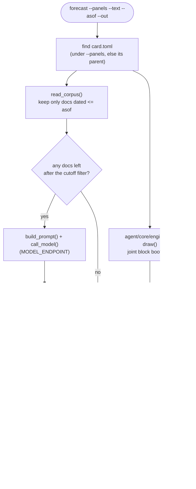
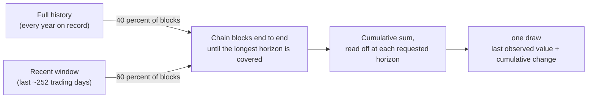
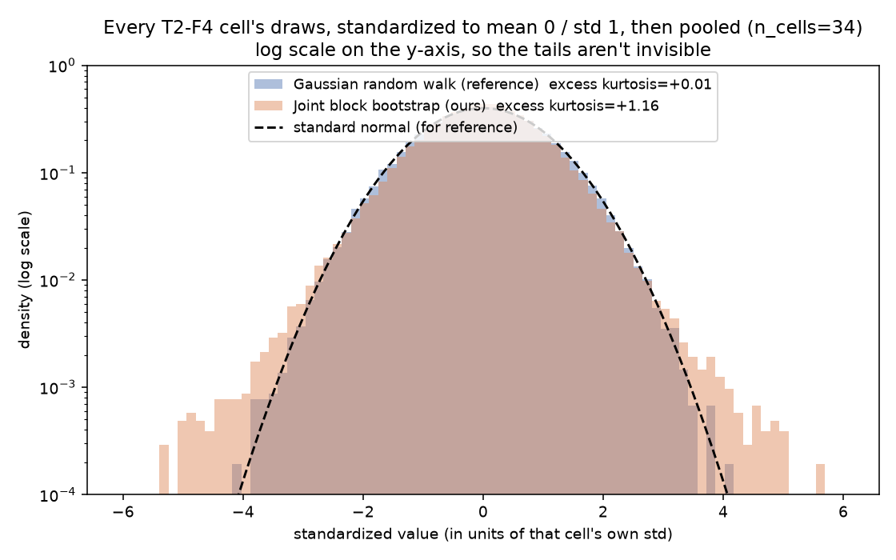
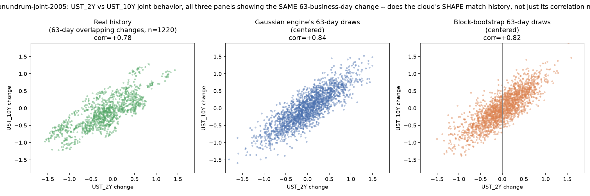
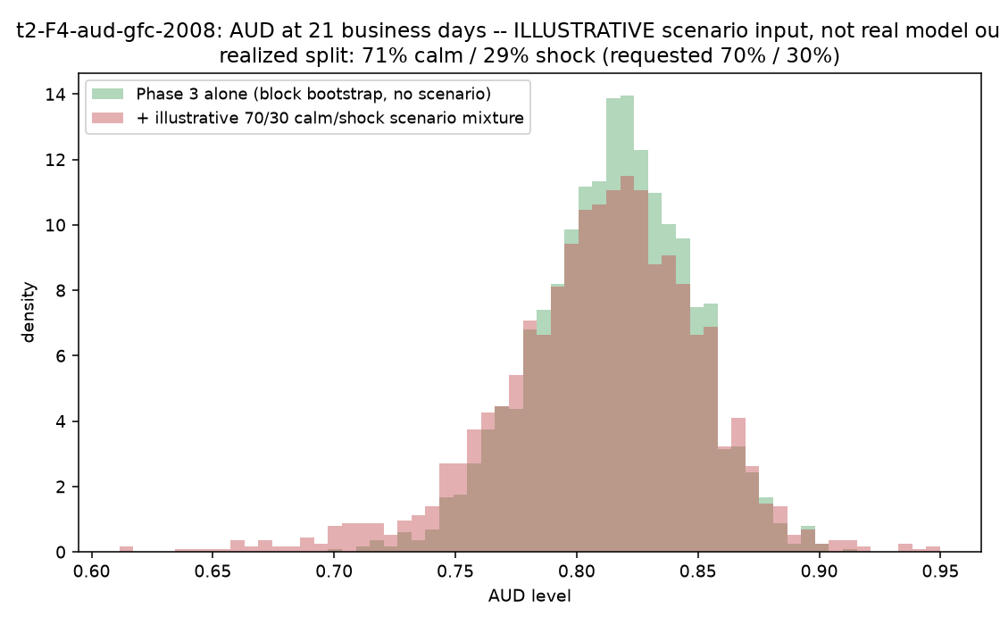

# Track 2 agent — development log

This documents the custom submission agent in this folder: what it does, why, and how it
differs from the organizer-shipped reference code. **Updated after every phase** — if you're
reading this mid-project, whatever's below is current as of the last phase listed in the
table of contents.

Nothing in `qfbench2_track_forecasting/` or `baselines/` is modified. Everything here is new
code that reuses pieces of those (imported, not copied) where they're already correct.

## Layout

```
agent/
├── core/           the actual submission agent -- this is what would be Docker-packaged
│   ├── cli.py         forecast entrypoint (harness contract)
│   ├── engine.py       statistical half: joint block bootstrap (Phase 3)
│   ├── prompt.py       reasoning half: scenario prompt (Phase 4)
│   └── adjust.py        reasoning half: scenario application + established/inferred clamp
├── tools/          developer-only -- NOT part of the submission, nothing in core/ imports these
│   ├── selfcheck.py    per-unit calibration diagnostics (Phase 2)
│   ├── sweep.py          aggregates selfcheck across many units (Phase 2)
│   └── viz.py             generates the plots embedded in this README
├── tests/          mocked unit + end-to-end tests (no MODEL_ENDPOINT needed for any of them)
├── assets/         images this README embeds
└── README.md       you are here
```

`core/` reuses pieces of `baselines/reasoning_agent.py` (corpus reading, the model HTTP call)
by import — nothing in `core/` duplicates that logic, and nothing in `core/` imports from
`tools/` or vice versa in the other direction (`tools/sweep.py` and `tools/viz.py` import
`agent.core.*` to exercise it, which is fine — the one-way rule is that `core/` itself stays
free of any `tools/` dependency, so the submission code never needs the dev tooling installed).

## Contents

- [How the agent works](#how-the-agent-works)
- [What we started from](#what-we-started-from)
- [Phase 1 — a harness-compatible wrapper](#phase-1--a-harness-compatible-wrapper)
- [Phase 2 — self-check tooling](#phase-2--self-check-tooling)
- [Phase 3 — a fat-tailed, history-driven engine](#phase-3--a-fat-tailed-history-driven-engine)
- [Phase 4 — scenario mixtures and the established-vs-inferred rule](#phase-4--scenario-mixtures-and-the-established-vs-inferred-rule)
- [Stats mechanics, explained simply](#stats-mechanics-explained-simply)
- [Current state / what's not done yet](#current-state--whats-not-done-yet)
- [How to reproduce these results](#how-to-reproduce-these-results)

---

## How the agent works

One run of `agent/core/cli.py` builds a forecast from two independent halves, then combines them.
The statistical half (left branch below) never touches the text; the reasoning half (right
branch) only ever *adjusts* what the statistical half already built — it can shift and
rescale the draws, never replace them from scratch.



`agent/core/engine.py`'s box is where Phase 3 lives. Zooming into just that box, one draw is built
like this:



Every "block" pulled from either pool is **one real historical date's actual joint change
across every target asset at once** — that's the whole mechanism; see
["stats mechanics"](#stats-mechanics-explained-simply) below for why that one design choice
produces both fat tails and realistic cross-asset correlation without any extra machinery.

---

## What we started from

The repository ships two things worth knowing about before reading the rest of this doc:

| File | What it does | What it's missing |
|---|---|---|
| `qfbench2_track_forecasting/cli.py` | The reference `forecast` CLI. Produces a **Gaussian random walk**: center = today's value, spread = historical daily volatility × √horizon. Correlated across assets via a fitted correlation matrix. | Never reads `--text` at all. Explicitly labelled "the statistical floor" in its own docstring. |
| `baselines/reasoning_agent.py` | A minimal *working* example of reading the text corpus and calling a model. Asks the model for two numbers per asset — `drift_bp` (shift the center) and `vol_scale` (widen/narrow, clamped to 0.5×–2.0×) — and applies them to the same Gaussian random walk above. | Its own docstring says so: "NOT a competitive method." Still Gaussian-shaped; still requires `--card` explicitly, which the real harness never passes. |

Both are good starting points, not something to throw away — `reasoning_agent.py`'s corpus
reading, model-call retry/fallback logic, and clamping are solid and are reused unchanged.

---

## Phase 1 — a harness-compatible wrapper

**Files:** [`agent/core/cli.py`](core/cli.py) (v1), [`agent/tests/test_cli_mocked.py`](tests/test_cli_mocked.py)

**Problem:** the real scoring harness invokes exactly
`forecast --panels /input/panels --text /input/text --asof YYYY-MM-DD --out /output/forecast.parquet`
— no `--card` flag. `reasoning_agent.py`'s `main()` requires `--card`. Run unmodified under
the harness, it exits on a missing argument before reading anything.

**What we built:** a wrapper that auto-detects `card.toml` (checking under `--panels`, then
its parent — the shipped exemplar keeps its panel at the unit root instead of a `panels/`
subdirectory, so both layouts need to work) and delegates to the unmodified reference agent.

**Verified:**
- Ran with no `MODEL_ENDPOINT` set (nothing was live yet) across one unit from each family
  (F1/F2/F3/F4) — all four produced valid output and passed every admissibility gate, with the
  corpus reader correctly respecting the as-of cutoff.
- Ran again with a *mocked* model reply containing a deliberately absurd `drift_bp` value —
  confirmed the reference agent's own clamping logic caught it (see the walkthrough under
  "Stats mechanics" below) rather than corrupting the forecast, and the result stayed
  admissible.

---

## Phase 2 — self-check tooling

**Files:** [`agent/tools/selfcheck.py`](tools/selfcheck.py), [`agent/tools/sweep.py`](tools/sweep.py)

**Problem:** the leaderboard doesn't exist yet, so there's no accuracy feedback of any kind.
We needed *something* that could catch calibration problems using only the as-of panel — no
realized outcomes, no model call.

**What we built:** `selfcheck.py` checks one forecast against its own unit's history —
is the spread about the right size, is it correlated across assets the way history says it
should be, how fat are the tails. `sweep.py` runs that check across every practice unit in a
family and averages the results, because a single card's tail-fatness reading is too noisy at
500 draws to trust on its own (see "why we aggregate" below).

**A bug we caught by actually running it:** the first sweep gave a wildly significant-looking
number (`z=+18.5`) for F4's tail fatness — which contradicted the math (see below) that says a
Gaussian random walk's tails can't be fat no matter what. Cause: every unit was using the same
fixed random seed (`0`), so 34 "independent" measurements were actually 34 copies of the exact
same random sequence, just rescaled. Fixed by giving each unit its own seed; the number dropped
to `z=+1.6` — squarely "not distinguishable from flat," as the math predicted. Worth keeping in
mind for later phases: a suspiciously strong signal is a reason to check the *tool*, not just
believe the result.

**Baseline established** (current engine at the time, still Gaussian):

| Family | n_cells | mean excess kurtosis | z | mean spread ratio |
|---|---|---|---|---|
| F1 | 43 | −0.000 | −0.0 | 1.00 |
| F2 | 28 | −0.045 | −1.3 | 1.01 |
| F3 | 162 | −0.026 | −1.4 | 1.00 |
| F4 | 34 | +0.064 | +1.6 | 1.01 |

Every family reads as flat (Gaussian-shaped) and matches historical volatility almost exactly
— this is the "before" picture Phase 3 was measured against.

---

## Phase 3 — a fat-tailed, history-driven engine

**Files:** [`agent/core/engine.py`](core/engine.py) (new), [`agent/core/cli.py`](core/cli.py) (rewritten to own
the pipeline instead of delegating), [`agent/tools/viz.py`](tools/viz.py) (new — generates the comparison
plots below)

**Problem:** the reference engine's Gaussian random walk mathematically cannot produce fat
tails no matter how the model's `vol_scale` is set (see "why scaling can't fatten a tail"
below) — and F4 cards specifically require fat tails.

**What we built:** a **joint block bootstrap**. Instead of generating synthetic noise, it
resamples real historical days: pick a random date, take that date's *actual* joint change
across every target asset at once, chain a short block of ~5 consecutive such days into one
path, repeat until the path reaches the forecast horizon. 60% of blocks are drawn from the most
recent ~252 trading days, 40% from the full history, so today's conditions and long-run tail
risk both show up. Longer horizons read off a longer prefix of the *same* path as shorter ones,
so different horizons in one draw aren't independent of each other either.

Real market history already contains rare extreme days, so fat tails and realistic cross-asset
correlation both come along automatically — no separate covariance-matrix-and-Cholesky step
needed, unlike the reference engine.

The reasoning half (`drift_bp`/`vol_scale`, corpus reading, the model prompt) is untouched in
this phase — Phase 3 only replaces the engine underneath it.

**Verified:**
- All four sample units (one per family) still pass every gate with the new engine.
- The mocked reasoning-path test still passes — the drift/vol clamping logic works identically
  regardless of which engine produced the underlying draws.
- **Full gate sweep across all 71 validation-split practice units: 71/71 admissible.**
- The kurtosis sweep, rerun after the change:

  | Family | n_cells | mean excess kurtosis (before → after) | z (before → after) | mean spread ratio |
  |---|---|---|---|---|
  | F1 | 43 | −0.000 → +0.069 | −0.0 → +1.9 | 0.90 |
  | F2 | 28 | −0.045 → +0.447 | −1.3 → +1.8 | 1.00 |
  | F3 | 162 | −0.026 → +0.401 | −1.4 → **+7.2** | 0.89 |
  | F4 | 34 | +0.064 → +1.207 | +1.6 → **+3.4** | 0.83 |

  F3 and F4 both moved to statistically real (not noise) positive kurtosis — F4 specifically
  is the family that most needed this. F1/F2 moved in the same direction but aren't
  statistically distinguishable from flat yet at this sample size; that's not necessarily wrong
  (F1 in particular isn't supposed to need fat tails per `docs/CATEGORIES.md`) but is worth
  re-checking once more units are swept.

**What that looks like, visually** (generated by [`agent/tools/viz.py`](tools/viz.py); rerun it after any
engine change to refresh these):



Every F4 unit's draws, standardized to the same scale (mean 0, std 1) and pooled together, so
this is the same aggregate the kurtosis table above measures — not one cherry-picked card. The
y-axis is **log scale**, which is what makes the tails visible at all: on an ordinary linear
axis the tails are too close to zero to see any difference. The Gaussian engine (blue) tracks
the dashed standard-normal curve tightly out to about ±4 standard deviations and then
disappears — textbook thin tails. The block bootstrap (orange) tracks the *same* curve through
the bulk of the distribution, then visibly lifts above it beyond about ±3, reaching out past
±5 — that gap between the orange bars and the black dashed line *is* the fat tail, made of
real historical extreme days rather than an assumed shape.



All three panels show the *same* thing — the 63-business-day change in UST_2Y vs. UST_10Y —
so the shapes are directly comparable. The correlation numbers come out similar across all
three (0.78 history, 0.84 Gaussian, 0.82 bootstrap) — that part isn't new to Phase 3, since the
reference engine already fits a correlation matrix on purpose. What's more interesting is the
*shape*: real history's cloud (green) isn't a clean ellipse — it's got a slight fan/curve to
it, denser in some directions than others. The Gaussian engine's cloud (blue) is a textbook
smooth ellipse, because that's mathematically all a Gaussian copula can ever produce. The
bootstrap's cloud (orange) inherits a bit of history's actual irregularity, because it's
literally built from history's own joint moves rather than a fitted formula.

- **One side effect worth flagging, not hiding:** `mean_spread_ratio` dropped from ~1.00 to
  0.83–0.90. The reference engine's spread is `daily_sd × √horizon` by construction — a textbook
  random-walk assumption. Real historical data has mean-reversion (a big move partly retraces),
  which the reference engine can't see and the block bootstrap now does, since it's built from
  actual historical paths rather than an idealized formula. A narrower realized spread than the
  naive random-walk formula predicts is consistent with real mean-reverting behavior, not
  obviously a bug — but it's a hypothesis, not a proven fact, and worth watching as more phases
  land.

---

## Stats mechanics, explained simply

### Random walk (what the reference engine does)

Tomorrow's value = today's value + random noise. The noise is Gaussian (bell-curve shaped) and
its size is set by how much the asset has historically moved per day, scaled up by √(number of
days ahead). No memory of trend, no story — just "today's value, plus however much this thing
typically wobbles."

### Why a bell curve isn't enough (fat tails)

A bell curve says extreme moves are *very* rare — rarer than real markets actually produce.
"Fat tails" means the real distribution has more probability in the extremes than a bell curve
of the same width would predict. **Kurtosis** is the number that measures this: exactly 0
(technically "excess kurtosis," measured against the Gaussian baseline of 3) for a true
Gaussian, positive for something fatter-tailed.

### Why scaling can't fatten a tail — the actual math

If you take a Gaussian variable `X` and scale it by a constant `c` (which is exactly what
`vol_scale` does), the kurtosis of `c·X` is:

```
kurtosis(c·X) = c⁴ · E[(X-mean)⁴] / (c² · Var(X))²  =  c⁴ · (...) / c⁴ · (...)  =  kurtosis(X)
```

The `c⁴` on top and bottom cancel exactly. This is true for *any* distribution, not just
Gaussian — scaling changes width, never shape. So no matter how large `vol_scale` gets, the
result is a wider bell curve, never a fatter-tailed one. To actually get fat tails you need a
different *shape*, not a different *size* — which is what the block bootstrap provides.

### Block bootstrap (what the new engine does)

Instead of inventing noise from a formula, resample real history: pick an actual historical
day, use what actually happened to every asset that day, and chain a few consecutive days
together (a "block," to keep realistic day-to-day momentum) to build one possible future path.
Repeat hundreds of times to get hundreds of possible futures. Since real markets already
contain crashes and spikes, resampling them gives you fat tails "for free" — no need to guess
how fat they should be.

### Regime blend

Markets go through calm periods and stressed periods. Pulling 100% of blocks from full history
would dilute a currently-stressed period with years of calm data; pulling 100% from only the
last year would ignore rare events that haven't happened recently. Mixing (60% recent, 40% full
history here) gets some of both.

### Scenario mixtures (Phase 4)

A "blob" forecast picks one center and one spread. But some situations aren't "I'm confident
it moves this way" — they're "it depends on which of a few things happens" (a hawkish hold vs.
a dovish pivot; a crisis resolving vs. escalating). A **scenario** is one of those possible
futures, with its own center/spread and a probability weight. Instead of averaging three
possible futures into one shifted-but-still-bell-shaped guess (which describes an outcome
nobody actually predicted), you draw the matching *share* of your Monte Carlo paths from each
scenario's own numbers — 55% of draws use scenario A's story, 30% use scenario B's, 15% use
scenario C's. The combined result can be lopsided or have a distinct extra hump, which is a far
more honest picture of "I think it's probably this, but there's a real chance of that instead"
than a single symmetric guess ever could be.

### Established vs. inferred

Not all evidence in the text is equally solid. "The FOMC voted to hike 25bp" is a stated fact —
you know it happened. "The speech sounded more hawkish than usual" is a judgment call about
tone. The rule: a stated fact may justify being *more* confident (a narrower distribution) than
the statistical baseline; a tone-based reading may only shift where you think the center is, and
must never be used to claim extra confidence. This has to be enforced in code (a hard floor on
how much a tone-based signal can narrow the distribution), not just requested in the prompt,
because a model can simply ignore a prompt instruction — the clamp can't.

### Joint / cross-asset correlation, the easy way

The reference engine achieves "the 2-year and 10-year yield move together realistically" by
fitting a correlation matrix from history and mathematically forcing Gaussian noise through it
(a "Cholesky decomposition" step). The block bootstrap gets the same effect for free: since
every block is *one real historical date's* joint change across all assets, whatever those
assets actually did together on that date comes along automatically. No matrix-fitting step
needed.

### Spread ratio / width sanity check

`draw_std / (historical daily volatility × √horizon)`. Near 1.0 means "about as wide as naive
historical volatility would suggest." This isn't a target to hit — a text-justified reason to
be much wider (a shock warning) or narrower (a stated fact) is fine — it's a smoke test for
*accidental* miscalibration (a bug that collapses or blows up the distribution).

### Why we aggregate before trusting a number (standard error, z-score)

Any single measurement has noise. At 500 draws, a *truly* flat distribution's measured kurtosis
can easily read anywhere from about −0.4 to +0.4 purely by chance — like one coin flip telling
you nothing reliable about whether a coin is fair. Averaging many independent measurements
shrinks that noise (roughly by √n), which is why `sweep.py` pools kurtosis across every cell in
a family rather than judging any single card's reading. The **z-score** (`mean ÷ standard
error`) turns that into a yes/no: `|z| > 2` means the average is probably a real effect, not
noise; `|z| < 2` means it could easily be nothing.

---

## Phase 4 — scenario mixtures and the established-vs-inferred rule

**Files:** [`agent/core/prompt.py`](core/prompt.py) (new), [`agent/core/adjust.py`](core/adjust.py) (new),
[`agent/core/cli.py`](core/cli.py) (updated to use them instead of `baselines.reasoning_agent`'s flat
contract), [`agent/tests/test_adjust.py`](tests/test_adjust.py) (new),
[`agent/tests/test_cli_scenarios_mocked.py`](tests/test_cli_scenarios_mocked.py) (new)

**Problem:** Phase 1–3's model contract was one adjustment per asset — a single `drift_bp` and
`vol_scale`, applied to every draw uniformly. Two things that separate winning solves per
`docs/SOLVER-PLAYBOOK.md` were still missing: (1) representing a genuinely branching outcome
("hike vs. hold") as a single averaged guess describes a future nobody in the text actually
predicted, and (2) nothing distinguished a stated fact from a tone-based guess, even though
`docs/RATIONALE-REVIEW.md` says confusing the two is exactly the signature of a memorized or
backward-built forecast.

**What we built:**

1. **A new reply shape.** Instead of one `drift_bp`/`vol_scale` pair, the model is asked for 1–4
   weighted **scenarios**, each specifying its own drift/vol for every asset in the card at
   once:
   ```json
   {"scenarios": [
     {"weight": 0.6, "basis": "inferred", "because": "...",
      "assets": {"UST_2Y": {"drift_bp": 40, "vol_scale": 1.0}, "...": {...}}},
     {"weight": 0.4, "basis": "established", "because": "...", "assets": {...}}
   ]}
   ```
   A reply in the old flat shape (no `scenarios` key) is still accepted — treated as a single
   scenario, weight 1.0, `basis="inferred"` — so nothing that worked in Phase 3 stops working.

2. **Scenario assignment is shared across every asset in a draw, not resampled per asset.**
   Each of the `n_draws` draw indices is randomly assigned to exactly one scenario (weighted by
   the model's stated probabilities), and that same assignment applies to *every* asset for
   that draw. This is what makes "in this draw, the Fed stays hawkish" move the whole yield
   curve together rather than letting each tenor pick its own independent story — exactly the
   F3 failure mode `docs/CATEGORIES.md` warns about.

3. **The established-vs-inferred rule, enforced as a hard clamp, not just a prompt
   instruction.** A scenario marked `"inferred"` (tone-based) is floored at `vol_scale >= 1.0`
   in code, regardless of what the model asks for — it cannot be used to narrow the
   distribution. Only `"established"` (a stated fact) can go below 1.0, down to the same 0.5
   floor Phase 1–3 always had. A prompt instruction alone can be ignored by the model; a code
   clamp cannot.

4. **The `vol_scale` ceiling was raised from 2.0× to 4.0×**, since a genuinely extreme scenario
   (F4's whole reason for existing) needs more room than Phase 1–3's cap allowed.

**Verified:**
- 5 unit tests on `apply_scenarios` in isolation ([`test_adjust.py`](tests/test_adjust.py)):
  backward compatibility with the old flat shape; **shared assignment** (two assets given
  wildly different drift per scenario never disagree on sign within the same draw — checked
  directly, not inferred); the established/inferred clamp (inferred floored at 1.0, established
  only at 0.5); the drift ceiling still holds; invalid/missing weights fall back to equal
  weighting rather than crashing.
- An end-to-end mocked test on a real 4-asset, 2-horizon F3 card
  ([`test_cli_scenarios_mocked.py`](tests/test_cli_scenarios_mocked.py)): a genuine two-scenario
  reply, realized scenario split close to the requested weights (0.59/0.41 realized vs. 0.60/0.40
  requested), a readable rationale showing both scenarios' basis and citations, still admissible.
- **Full gate sweep, all 71 validation units, with the actual two-scenario mixture applied (not
  the fallback path): 71/71 admissible** — including a 10-asset card, confirming the mechanism
  holds up across the real diversity of card shapes, not just the one hand-picked example.

**What this looks like, mechanically** (generated by [`agent/tools/viz.py`](tools/viz.py)):



**This is not a real model's output** — there's still no `MODEL_ENDPOINT` available (see below)
— it's a hand-picked, clearly-labeled 70/30 calm/shock scenario pair applied via the real
`apply_scenarios` code to real Phase-3 draws, to show the *mechanism*, not forecast quality. You
can see the shock scenario (30% weight, large negative drift, wider vol) adds visible extra
mass on the left side of the distribution (roughly 0.70–0.78) that Phase 3 alone doesn't have —
exactly what a scenario mixture is supposed to do: represent a specific adverse story as its own
cluster of draws rather than diluting it into one shifted-but-still-symmetric blob.

---

## Current state / what's not done yet

- **Phase 5 (not started):** per-family behavior keyed off `card.toml`'s category — e.g. forcing
  wider tail latitude specifically for F2/F4, or requiring at least 2 scenarios whenever the
  corpus contains an unresolved policy decision.
- **No real model access yet.** Everything reasoning-related — Phases 1, 3, and 4 alike — has
  only been tested against *mocked* model replies. There's still no `MODEL_ENDPOINT` available
  locally (the organizer's house proxy isn't live, and this session has no Anthropic API key),
  so the prompt/parsing/clamping logic is verified deterministically but real prompting quality
  — does a real model actually produce sensible, well-cited scenarios? — is still completely
  unknown. This is the single biggest open question hanging over everything above it.
- **Gate sweep so far covers the 71 `validation`-split units, not the full 103** (includes
  `public-dev`), and only ever with either the offline fallback or a hand-mocked reply — worth
  widening once real model access exists.
- **Docker packaging (Phase 7 in the original plan) hasn't started** — everything so far has
  been run directly with Python, not inside the submission container.

---

## How to reproduce these results

```bash
source .venv/bin/activate   # Python 3.13 venv; see the main README's Quick-start checklist step 0
pip install matplotlib      # only needed for agent/tools/viz.py -- not part of the submission image

# One unit, offline (no model call)
python -m agent.core.cli --panels units/t2-F1-cad-boc-2017 --text units/t2-F1-cad-boc-2017/text \
  --asof 2017-07-12 --out /tmp/out/forecast.parquet
python scoring/scoring.py score --card units/t2-F1-cad-boc-2017/card.toml \
  --forecast /tmp/out/forecast.parquet

# Self-check one forecast
python -m agent.tools.selfcheck --unit units/t2-F1-cad-boc-2017 --forecast /tmp/out/forecast.parquet \
  --asof 2017-07-12

# Aggregate kurtosis/spread across a whole family
python -m agent.tools.sweep --category T2-F4

# Mocked reasoning-path tests (no model endpoint needed)
python agent/tests/test_cli_mocked.py             # Phase 1: old flat-shape reply, backward compat
python agent/tests/test_adjust.py                 # Phase 4: apply_scenarios unit tests
python agent/tests/test_cli_scenarios_mocked.py   # Phase 4: end-to-end, real multi-asset card

# Regenerate the comparison plots in this README (run after any agent/core/engine.py change)
python -m agent.tools.viz
```
